# Деревья процессов и правил системы обслуживания

Ниже схемы в формате “событие → решение → действие → следующий ответственный”.  
Их можно использовать как основу для презентации руководству.

## 1. Общая заявка на обслуживание

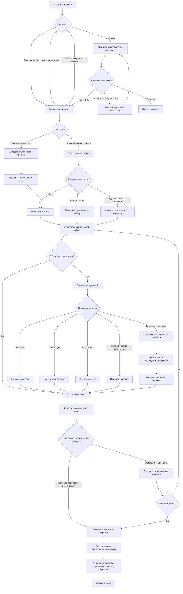

## 2. Заявка от работника

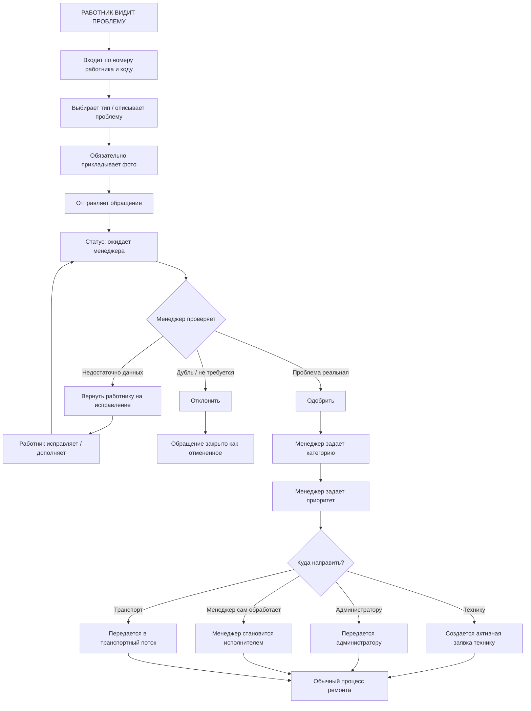

## 3. Заявка по транспорту / погрузчику

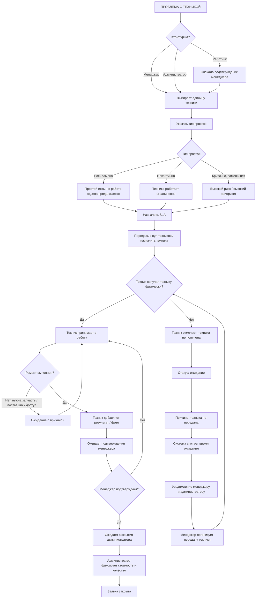

## 4. Заявка по зданию / инфраструктуре

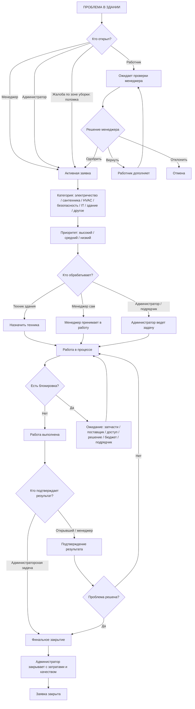

## 5. Закрытие заявки

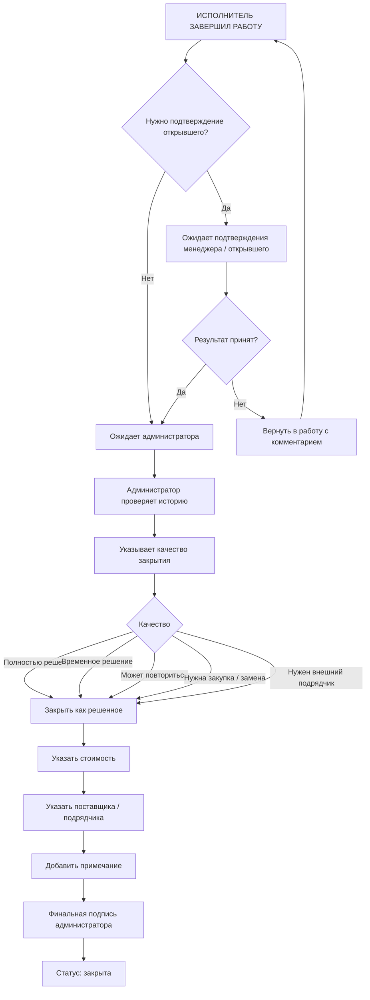

## 6. Контур уборки: плановый обход

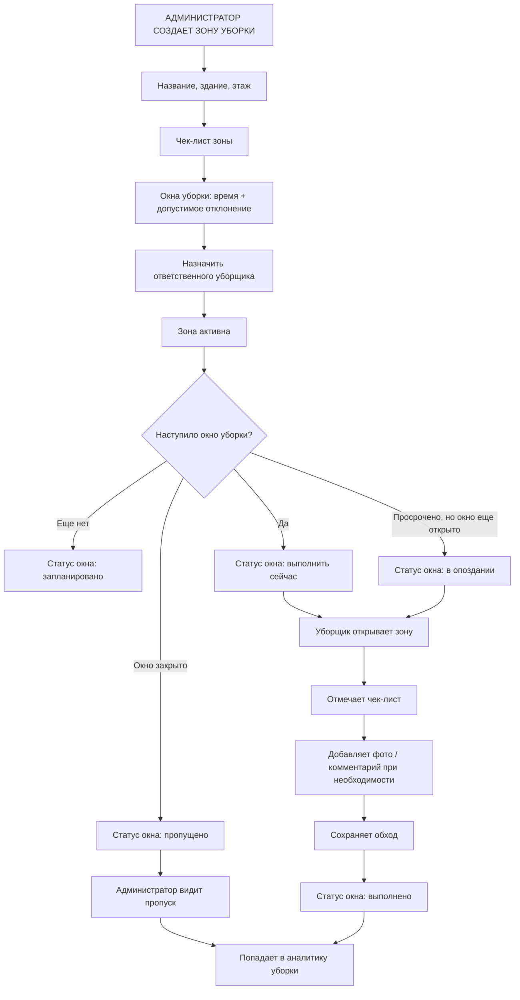

## 7. Жалоба по уборке / зоне

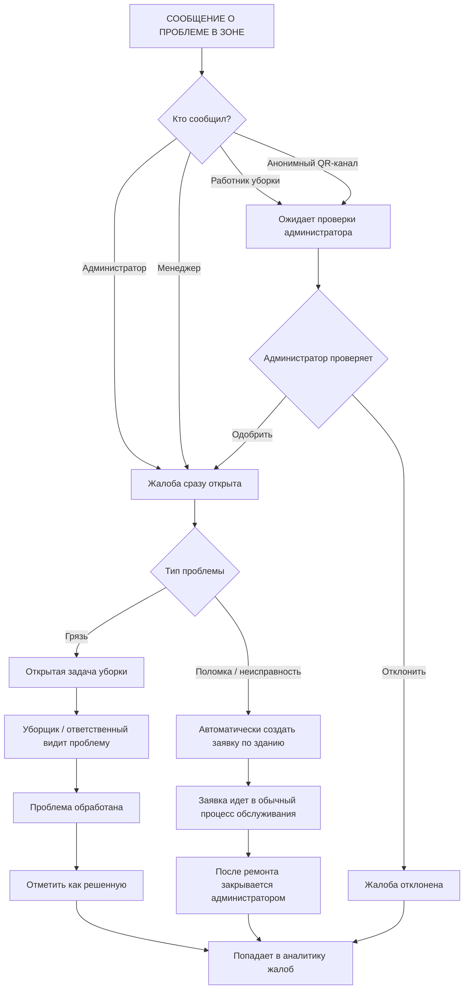

## 8. Анонимный QR-канал

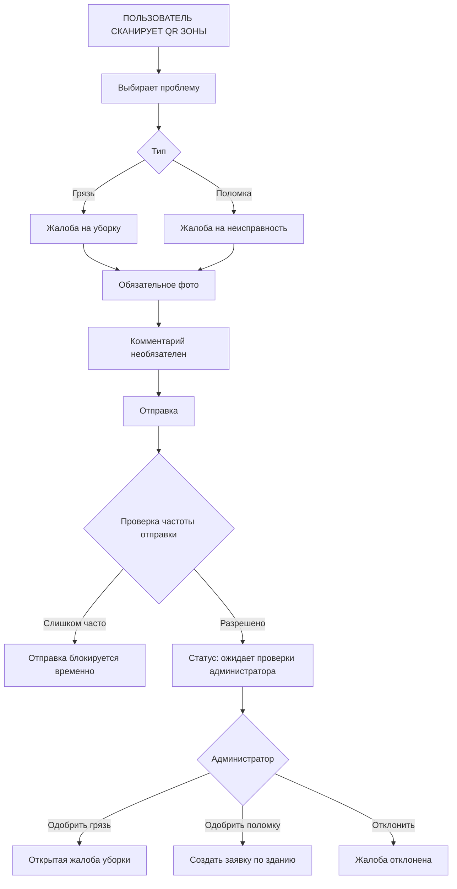

## 9. Документы и плановое обслуживание техники

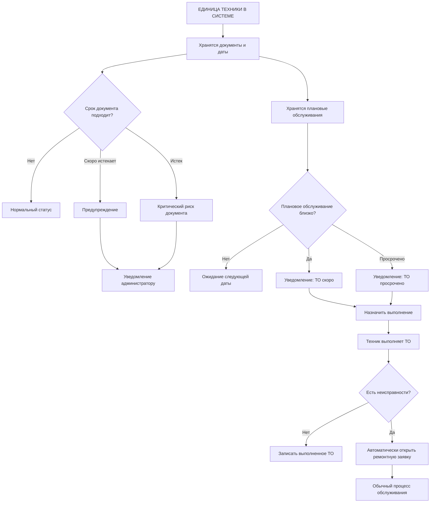

## 10. Назначение водителей на технику

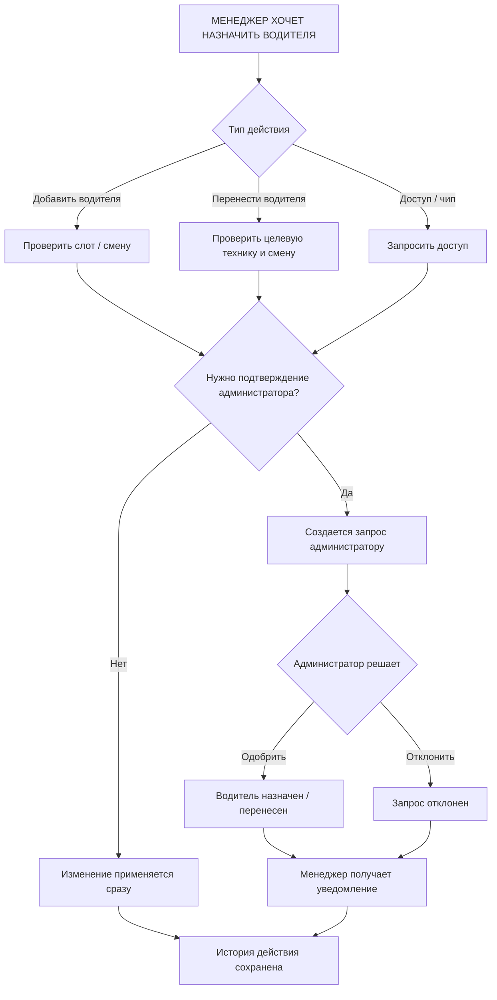

## 11. Короткое правило ответственности

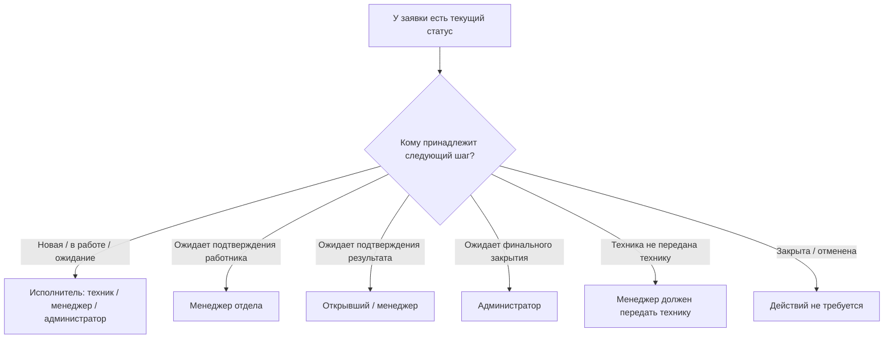

