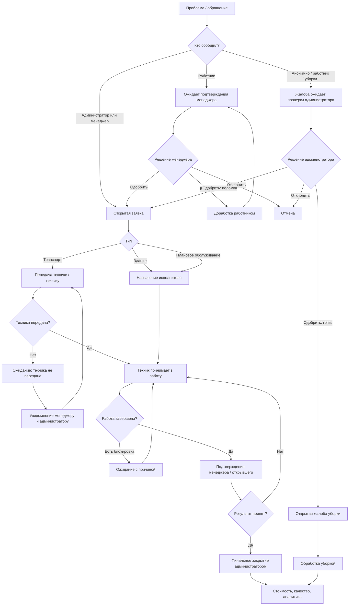

# Логика и цепочка процессов автоматизированной системы обслуживания

## 1. Назначение системы

Система предназначена для управления техническим обслуживанием логистического центра:

- обслуживание здания и инженерных систем;
- обслуживание парка погрузчиков и складской техники;
- плановые проверки, документы, лицензии, техосмотры и лизинг;
- заявки от сотрудников и менеджеров;
- работа техников и подрядчиков;
- отдельный контур уборки: зоны, обходы, жалобы, контроль выполнения;
- уведомления, SLA, аналитика и история действий.

Главная идея: каждая проблема превращается в управляемую заявку с ответственным, статусом, сроком, историей, подтверждением выполнения и финальным закрытием.

## 2. Основные роли

### Администратор системы

Видит всю систему и отвечает за финальный контроль.

Что делает:

- создает и редактирует заявки;
- назначает техников;
- видит все отделы, технику, уборку и аналитику;
- закрывает заявки окончательно;
- фиксирует стоимость, поставщика и качество закрытия;
- управляет пользователями, зонами уборки, техникой, документами и плановыми работами;
- подтверждает или отклоняет анонимные и неподтвержденные жалобы по уборке.

### Менеджер отдела

Видит только область ответственности своего отдела.

Что делает:

- открывает заявки по своему отделу;
- подтверждает заявки сотрудников;
- подтверждает, что проблема действительно решена;
- может вернуть заявку в работу, если проблема не устранена;
- контролирует технику, связанную с его отделом;
- видит зоны уборки, закрепленные за его отделом;
- сообщает о проблемах уборки или неисправностях в зоне.

### Техник

Исполнитель работ.

Что делает:

- принимает заявку в работу;
- отмечает ход ремонта;
- указывает причину ожидания, если работа заблокирована;
- по транспортным заявкам может указать, что техника физически не передана ему;
- прикладывает фото результата;
- завершает работу и передает заявку на подтверждение.

Техник не закрывает заявку окончательно и не подтверждает результат за заказчика.

### Работник

Открывает простую заявку через рабочий номер и код.

Что делает:

- сообщает о проблеме;
- обязательно прикладывает фото;
- видит только свои обращения;
- если менеджер вернул заявку на доработку, может исправить и отправить повторно.

### Работник уборки

Работает в отдельном контуре уборки.

Что делает:

- видит свои зоны уборки;
- видит зоны, где может выполнить подмену;
- выполняет обход по чек-листу;
- фиксирует результат, время, фото и комментарий;
- видит открытые жалобы по своим зонам.

## 3. Типы работ

### Здание и инфраструктура

Примеры:

- электричество;
- сантехника;
- кондиционирование;
- механика;
- безопасность;
- IT;
- двери, стены, полы, помещения;
- уборка как категория обслуживания.

### Транспорт и складская техника

Примеры:

- погрузчики;
- тележки;
- подъемные платформы;
- документы на технику;
- периодические проверки;
- ремонт, простой, замена техники;
- назначение водителей и смен.

### Уборка

Примеры:

- зоны уборки;
- плановые обходы;
- чек-листы;
- пропущенные окна уборки;
- жалобы на грязь;
- жалобы на поломки в зоне уборки.

## 4. Жизненный цикл обычной заявки

Основной поток:

1. Заявка создается.
2. Система определяет направление: здание или транспорт.
3. Назначается приоритет и срок SLA.
4. Ответственный принимает заявку в работу.
5. Если есть блокировка, заявка переходит в ожидание с причиной.
6. После выполнения заявка передается на подтверждение.
7. Менеджер или администратор подтверждает, что проблема решена.
8. Администратор закрывает заявку окончательно с указанием стоимости и качества результата.

Статусы:

- `new` - новая заявка;
- `in_progress` - в работе;
- `waiting` - ожидание;
- `pending_user` - ожидает подтверждения открывшего или менеджера;
- `pending_admin` - ожидает финального закрытия администратором;
- `done` - закрыта;
- `cancelled` - отменена.

## 5. Заявка от работника

Это отдельный входной канал с обязательной проверкой менеджером.

Цепочка:

1. Работник сообщает о проблеме и прикладывает фото.
2. Заявка получает статус `pending_manager`.
3. Менеджер отдела проверяет обращение.
4. Менеджер выбирает одно из решений:

- одобрить;
- вернуть работнику на исправление;
- отклонить.

Если заявка одобрена:

- ей назначается категория;
- назначается приоритет;
- выбирается исполнитель: техник, менеджер, администратор или транспортный поток;
- заявка переходит в обычный жизненный цикл.

Если заявка возвращена:

- статус становится `rework`;
- работник должен дополнить или исправить данные;
- после повторной отправки заявка снова попадает менеджеру.

Если заявка отклонена:

- она закрывается как `cancelled`;
- фиксируется причина: дубль, не требуется, недостаточно информации.

## 6. Кто должен действовать сейчас

В системе есть центральное правило: для каждой заявки определяется, у кого сейчас “мяч”.

Правила:

- новая заявка, заявка в работе или в ожидании обычно находится у исполнителя;
- если заявка по зданию еще без исполнителя, она находится у администратора;
- если техник завершил работу, заявка переходит к менеджеру или открывшему;
- после подтверждения результата заявка переходит к администратору;
- заявка от работника сначала находится у менеджера;
- закрытые и отмененные заявки больше не требуют действий.

Особый случай:

- если транспортная заявка в ожидании, потому что техника не передана технику, ответственность переходит к менеджеру, который должен физически обеспечить передачу техники.

## 7. Сценарий “техник не получил технику”

Это важный управленческий сценарий для транспорта.

Цепочка:

1. Транспортная заявка открыта.
2. Техник видит заявку, но техника ему не передана.
3. Техник нажимает “не получил технику”.
4. Заявка переходит в `waiting`.
5. Причина ожидания: `no_equipment`.
6. Система начинает считать время ожидания.
7. Менеджер и администратор получают уведомление.
8. После передачи техники техник нажимает “техника получена”.
9. Заявка возвращается в работу.
10. Накопленное время ожидания сохраняется для аналитики простоев.

Зачем это нужно:

- видно, где ремонт задерживается не из-за техника;
- можно измерить простой по причине непередачи техники;
- ответственность становится прозрачной.

## 8. Приоритеты и SLA

Каждая заявка имеет приоритет:

- высокий;
- средний;
- низкий.

SLA рассчитывается по правилам:

- для здания - по категории заявки;
- для транспорта - по типу или модели техники;
- если есть ручное переопределение SLA, оно имеет приоритет.

Система подсвечивает:

- просроченные заявки;
- заявки, близкие к нарушению SLA;
- критические простои без назначенного техника;
- заявки без ответственного;
- заявки в ожидании;
- повторяющиеся проблемы по одной технике или зоне.

## 9. Финальное закрытие заявки

Закрытие выполняет администратор.

При закрытии фиксируется:

- стоимость;
- поставщик или подрядчик;
- комментарий;
- дата фактического завершения;
- качество результата.

Варианты качества:

- полностью решено;
- временное решение;
- может повториться;
- требуется закупка или замена;
- нужен внешний подрядчик.

Это важно для аналитики: система не просто закрывает задачу, а сохраняет качество решения и будущие риски.

## 10. Уведомления

Система формирует уведомления по ролям.

Администратор получает:

- новые заявки;
- заявки на финальное закрытие;
- нарушения SLA;
- критические простои без техника;
- документы техники с истекающим сроком;
- плановые работы;
- заявки по водителям;
- пропущенные обходы уборки;
- жалобы, ожидающие подтверждения.

Менеджер получает:

- заявки, ожидающие его подтверждения;
- заявки, где проблема якобы решена и нужна проверка;
- ситуацию, когда техника не передана технику;
- обновления по заявкам отдела;
- уведомления по технике отдела;
- открытые жалобы по закрепленным зонам уборки.

Техник получает:

- новые доступные заявки;
- плановые работы;
- возвращенные заявки;
- задачи в зоне своей ответственности.

Работник уборки получает:

- обходы, которые нужно выполнить сейчас;
- просроченные обходы;
- открытые жалобы по своим зонам.

## 11. Контур уборки

Уборка работает как отдельная подсистема.

Основные сущности:

- зона уборки;
- чек-лист зоны;
- временные окна обходов;
- ответственный работник уборки;
- факт выполненного обхода;
- жалоба по зоне.

Цепочка обхода:

1. Администратор создает зону уборки.
2. У зоны есть место, чек-лист, окна выполнения и ответственный.
3. Работник уборки видит свои зоны.
4. В нужное время система показывает, что нужно выполнить обход.
5. Работник отмечает пункты чек-листа.
6. Может добавить фото и комментарий.
7. Система сохраняет факт обхода.
8. Руководство видит выполнение по зонам и дням.

Статусы окна уборки:

- `pending` - окно еще не наступило;
- `due` - нужно выполнить сейчас;
- `overdue` - окно уже просрочено, но еще можно выполнить;
- `missed` - окно закрыто и считается пропущенным;
- `done` - обход выполнен.

## 12. Жалобы по уборке и зонам

Жалоба может быть двух типов:

- грязь;
- поломка или неисправность.

Фото обязательно.

Цепочка для менеджера или администратора:

1. Пользователь выбирает зону.
2. Выбирает тип проблемы.
3. Прикладывает фото.
4. Отправляет жалобу.
5. Жалоба сразу становится открытой.

Цепочка для работника или анонимного канала:

1. Пользователь отправляет жалобу.
2. Жалоба получает статус `pending`.
3. Администратор проверяет ее.
4. Администратор одобряет или отклоняет.

Если это жалоба “грязь”:

- она остается задачей уборки;
- после обработки отмечается как решенная.

Если это “поломка”:

- система автоматически создает обычную заявку по зданию;
- жалоба связывается с этой заявкой;
- дальше она идет по стандартному процессу технического обслуживания.

## 13. Анонимный публичный канал

Система предусматривает публичный вход через QR или ручной выбор зоны.

Логика:

1. Человек выбирает или сканирует зону.
2. Выбирает тип проблемы.
3. Обязательно прикладывает фото.
4. Отправляет сообщение.
5. Система ограничивает частоту отправки с устройства.
6. Сообщение попадает администратору на проверку.
7. После одобрения оно становится открытой жалобой.

Цель:

- дать быстрый канал сообщения о проблеме;
- не засорять систему неподтвержденными обращениями;
- сохранить управленческий контроль через подтверждение администратора.

## 14. Транспорт, документы и плановое обслуживание

Для техники система хранит:

- код единицы;
- модель;
- поставщика;
- документы;
- сроки действия;
- стоимость лизинга;
- историю заявок;
- проверки;
- плановые обслуживания;
- привязку к отделам;
- водителей и смены.

Система отслеживает:

- истечение документов;
- просрочку планового обслуживания;
- повторяющиеся неисправности;
- стоимость ремонтов;
- простой техники;
- критические неисправности;
- документы с истекшим сроком.

Если по технике много повторных заявок, система показывает рекомендацию рассмотреть корневую проблему, поставщика или замену.

## 15. Назначение водителей

Менеджер может запросить:

- добавление водителя на технику;
- перенос водителя между единицами техники;
- выдачу чипа или доступа.

Если действие требует подтверждения:

1. Менеджер отправляет запрос.
2. Администратор видит запрос.
3. Администратор одобряет или отклоняет.
4. Менеджер получает уведомление о решении.

## 16. Аналитика

Система собирает данные для управленческих выводов:

- количество заявок;
- открытые и закрытые заявки;
- просрочки SLA;
- стоимость ремонтов;
- простой техники;
- причины ожидания;
- время ожидания техники у техника;
- повторные проблемы;
- документы с риском истечения;
- выполнение уборки по зонам;
- жалобы по зонам;
- жалобы по зданиям;
- процент выполнения обходов в срок.

## 17. Главная логика принятия решений

Система каждый раз отвечает на четыре вопроса:

1. Что случилось?

- здание;
- транспорт;
- уборка;
- жалоба;
- документ;
- плановое обслуживание.

2. Кто сообщил?

- администратор;
- менеджер;
- техник;
- работник;
- работник уборки;
- анонимный пользователь.

3. Кто должен принять решение?

- менеджер подтверждает обращения работников и результат работ;
- техник выполняет работы;
- администратор назначает, контролирует и закрывает;
- работник уборки выполняет обход;
- администратор проверяет неподтвержденные жалобы.

4. Что должно произойти дальше?

- назначить исполнителя;
- принять в работу;
- ждать внешнего условия;
- подтвердить результат;
- вернуть на доработку;
- закрыть с затратами;
- создать техническую заявку из жалобы;
- уведомить нужную роль;
- включить событие в аналитику.

## 18. Управленческая ценность

Система дает руководству:

- прозрачность: видно, кто сейчас должен действовать;
- контроль SLA: понятно, где нарушение и почему;
- контроль простоев: особенно по транспортной технике;
- доказательность: фото до и после, история действий;
- разделение ответственности: работник сообщает, менеджер подтверждает, техник выполняет, администратор закрывает;
- снижение хаоса: все обращения проходят через единый процесс;
- аналитику затрат и повторных неисправностей;
- контроль уборки не по ощущениям, а по фактам обходов и жалобам;
- возможность масштабирования: роли, зоны, техника, документы и процессы уже разделены.

## 19. Короткая схема для презентации

